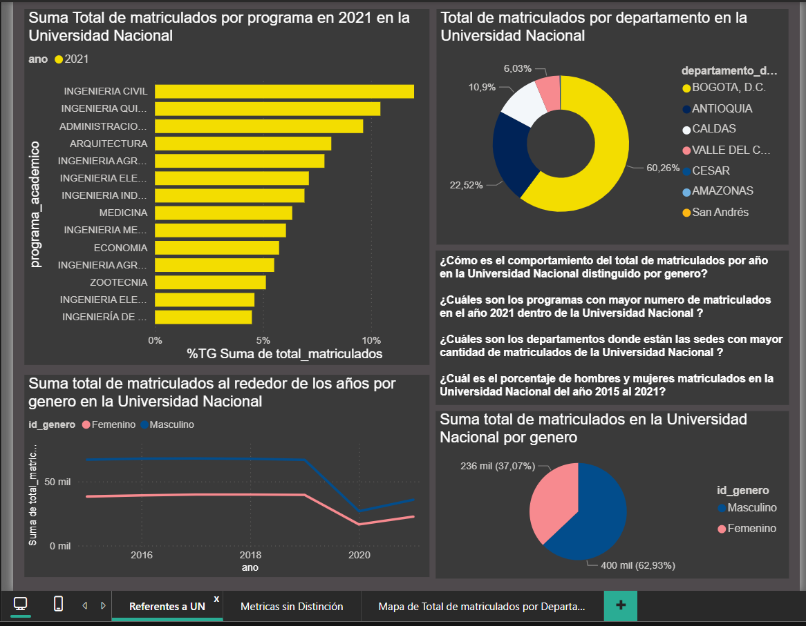
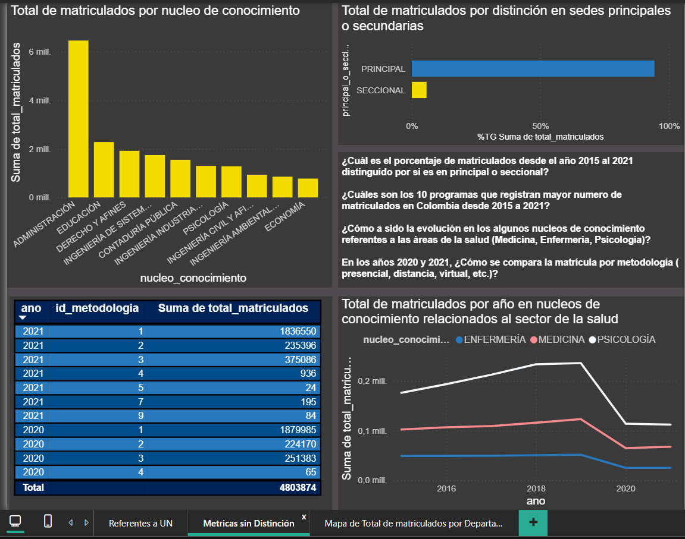
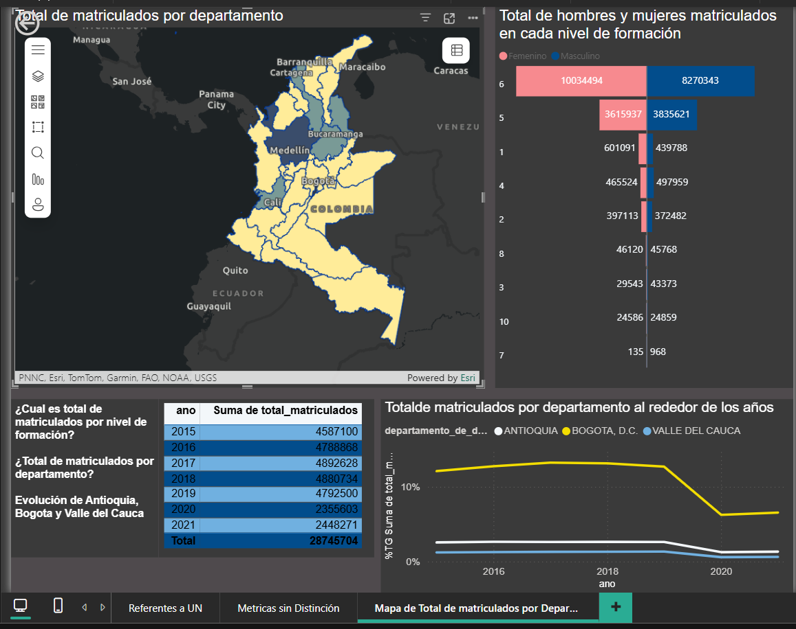

# POWER-BI----Matricula-de-Educacion-Superior-Colombia
Dashboard en Power BI sobre matrícula de educación superior (2015–2024) usando datos abiertos del MEN.

# Medidas DAX
Aquí listaré las medidas DAX utilizadas en el dashboard.

- Total Matriculados
- % del total
- Comparaciones por año

## Datos
Este proyecto usa el conjunto de datos público **MEN_MATRICULA_ESTADISTICA_ES** del portal datos.gov.co.

- Fuente: Ministerio de Educación Nacional (MEN)
- Periodo: 2015–2024
- Enlace oficial: https://www.datos.gov.co/Educaci-n/MEN_MATRICULA_ESTADISTICA_ES/5wck-szir

## Capturas

### Panel 1 — Referentes a UN

### Panel 2 — Métricas sin distinción

### Panel 3 — Mapa / Departamento

## Descargar el archivo Power BI
- PBIX: [Proyecto.pbix](powerbi/Proyecto.pbix)
